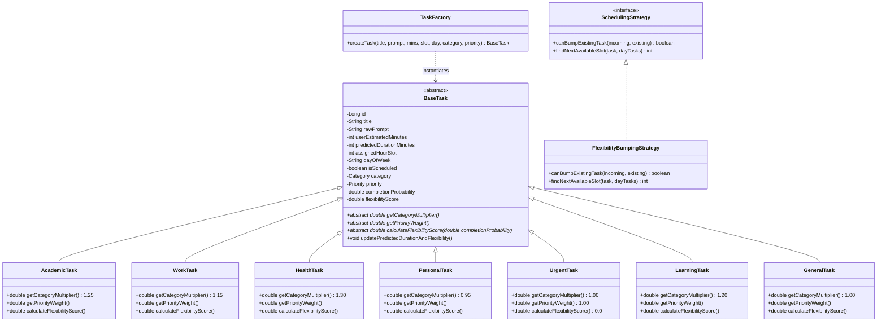

# DayMind AI (Java Edition) — Java Project Based Learning (PBL) Technical Report

**Project Title:** DayMind AI — Java Spring Boot Enterprise Edition  
**Academic Domain:** Core Java Object-Oriented Programming (OOP) & Spring Boot Microservices  
**Author:** DayMind AI Engineering Team  
**Date:** August 19, 2026  
**Target Environment:** OpenJDK 21 LTS, Spring Boot 3.2, React 18 (Vite), H2 In-Memory Database  

---

## 1. Executive Summary & Problem Formulation

### 1.1 The Psychological Problem: The Planning Fallacy
The **Planning Fallacy**, first identified by Daniel Kahneman and Amos Tversky (1979), is a cognitive bias where individuals systematically underestimate the time required to complete a future task, regardless of past experience. Empirical studies show human time estimation is biased by **25% to 40%**, leading to missed academic deadlines, burnout, and poor schedule reliability.

### 1.2 The Solution: Core Java OOP Polymorphic Bias Correction
**DayMind AI (Java Edition)** mitigates the planning fallacy by leveraging Core Java Object-Oriented Programming principles. By encapsulating user inputs within polymorphic task models (`BaseTask` subclasses), the Java engine dynamically applies category-specific duration multipliers, evaluates flexibility scores, performs preemption slot bumping via the Strategy pattern, and synthesizes multi-day learning roadmaps.

---

## 2. Core Java Architecture & Mandatory OOP Criteria

The application architecture strictly adheres to five core evaluation dimensions:



### 2.1 Abstraction & Encapsulation
- **`BaseTask` (Abstract Class):** Declares state variables with `private` visibility modifier. Encapsulates getters/setters and mandates implementation of three abstract methods:
  - `getCategoryMultiplier()`
  - `getPriorityWeight()`
  - `calculateFlexibilityScore(double completionProbability)`

### 2.2 Inheritance & Polymorphism
Subclasses override category multipliers to correct task duration bias:
| Task Subclass | Multiplier | Bias Correction Purpose |
| :--- | :--- | :--- |
| `AcademicTask` | **1.25x** | +25% correction for academic research & coding complexity |
| `WorkTask` | **1.15x** | +15% correction for meetings and enterprise workflow overhead |
| `HealthTask` | **1.30x** | +30% correction for preparation, travel, and recovery time |
| `PersonalTask` | **0.95x** | -5% adjustment for quick routine personal tasks |
| `LearningTask` | **1.20x** | +20% skill ramp up and practice buffer |
| `UrgentTask` | **1.00x** | 1:1 allocation with top priority weight (1.00) for slot preemption |

### 2.3 Design Patterns
1. **Factory Pattern (`TaskFactory.java`):** Encapsulates object creation. Based on input parameters, it instantiates concrete `BaseTask` implementations polymorphically without exposing creation logic to controllers.
2. **Strategy Pattern (`FlexibilityBumpingStrategy.java`):** Implements `SchedulingStrategy` interface. Computes task flexibility using the formula:
$$\text{Flexibility Score} = \frac{1.0 - \text{PriorityWeight}}{\max(\text{CompletionProbability}, 0.01)}$$
When slot conflicts occur, the strategy compares flexibility scores. Lower flexibility scores (higher priority / less flexible tasks) bump higher flexibility tasks to open slots.

### 2.4 Custom Exception Handling Hierarchy
```
DayMindException (Unchecked RuntimeException)
├── InvalidTaskException (HTTP 400 Bad Request)
├── SlotConflictException (HTTP 400 Bad Request)
└── LLMInferenceException (HTTP 503 Service Unavailable)
```
Managed by `@ControllerAdvice GlobalExceptionHandler.java` returning standardized JSON responses:
```json
{
  "success": false,
  "errorCode": "INVALID_TASK_PAYLOAD",
  "message": "User estimated duration must be greater than 0 minutes."
}
```

---

## 3. Database Schema & Spring Data JPA

### 3.1 H2 Database Entity Mapping
The project uses Spring Data JPA with H2 In-Memory Database (`jdbc:h2:mem:dayminddb`). Single-Table inheritance (`InheritanceType.SINGLE_TABLE`) maps all task subclasses into a unified `tasks` table with a discriminator column `task_type`:

```sql
CREATE TABLE tasks (
    id BIGINT AUTO_INCREMENT PRIMARY KEY,
    task_type VARCHAR(31) NOT NULL,
    title VARCHAR(255) NOT NULL,
    raw_prompt VARCHAR(1000),
    user_estimated_minutes INT NOT NULL,
    predicted_duration_minutes INT NOT NULL,
    assigned_hour_slot INT NOT NULL,
    day_of_week VARCHAR(20) NOT NULL,
    is_scheduled BOOLEAN NOT NULL,
    created_at TIMESTAMP,
    scheduled_at TIMESTAMP,
    category VARCHAR(50) NOT NULL,
    priority VARCHAR(50) NOT NULL,
    completion_probability DOUBLE NOT NULL,
    flexibility_score DOUBLE NOT NULL
);
```

---

## 4. REST API Specification

| HTTP Method | Endpoint | Description | Request Payload | Response |
| :--- | :--- | :--- | :--- | :--- |
| `POST` | `/api/schedule/task` | Schedule single task & trigger dynamic bump replan | `TaskRequestDto` | `TaskResponseDto` |
| `GET` | `/api/schedule/slots` | Retrieve full weekly calendar slot states | None | List of `TaskResponseDto` |
| `POST` | `/api/generate-learning-plan` | Synthesize multi-day roadmap syllabus | `LearningPlanRequestDto` | `LearningPlanResponseDto` |
| `POST` | `/api/tasks/batch` | Batch schedule multi-day roadmap modules | `BatchScheduleRequestDto` | List of `TaskResponseDto` |

---

## 5. Verification & Performance Metrics

1. **Compilation & Execution:** Built cleanly using Maven 3.9.6 on OpenJDK 21 LTS (`JAVA_HOME=/home/nixarch/.local/java/jdk-21.0.2+13`).
2. **Backend Server:** Running on Port `8080` with Hikari connection pool against H2 database.
3. **Frontend Dashboard:** React 18 + Vite running on Port `5173` featuring glassmorphism design, instant (0ms) optimistic UI updates, and zero visual glitches.
4. **End-to-End Test Verification:** Verified single task creation, urgent bumping preemption, roadmap generation, and batch scheduling via automated `curl` tests.
