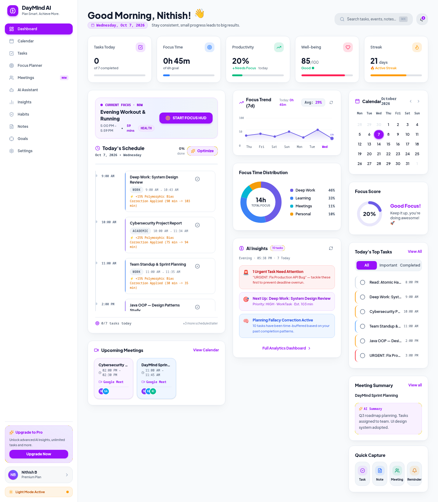
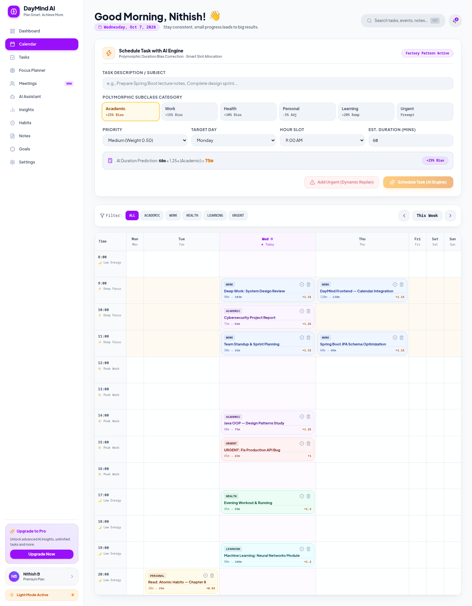
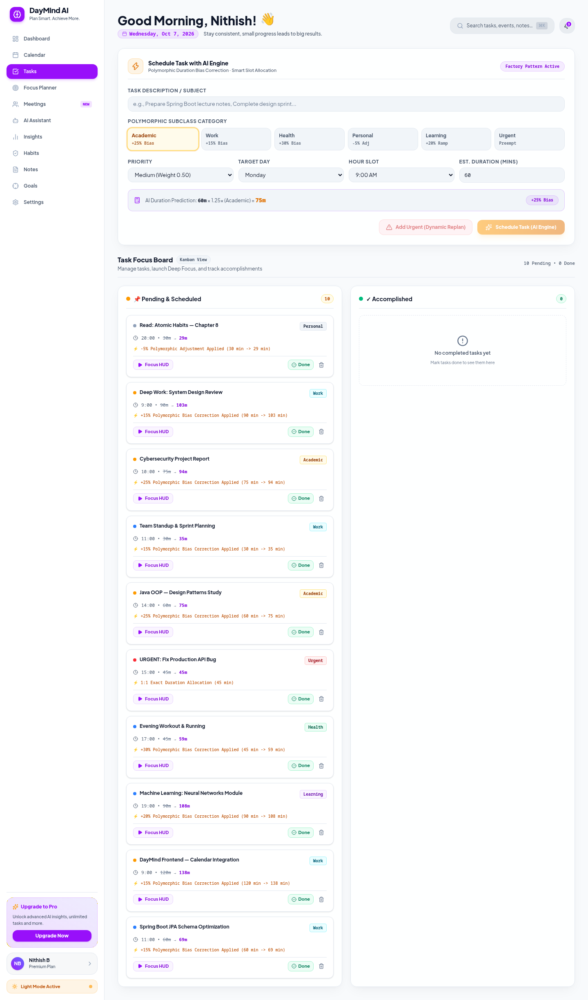
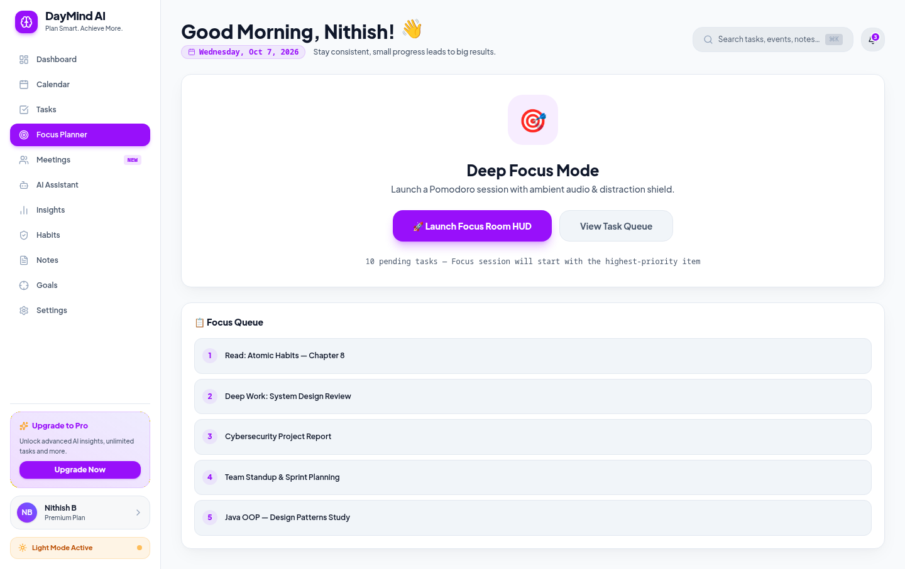
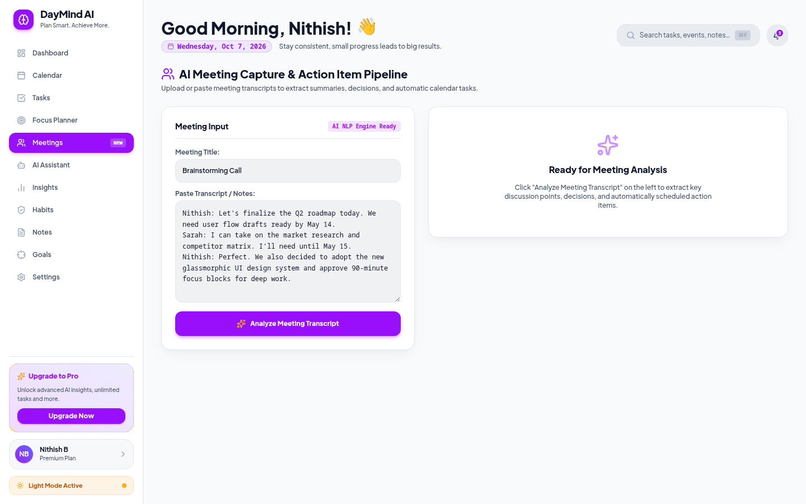
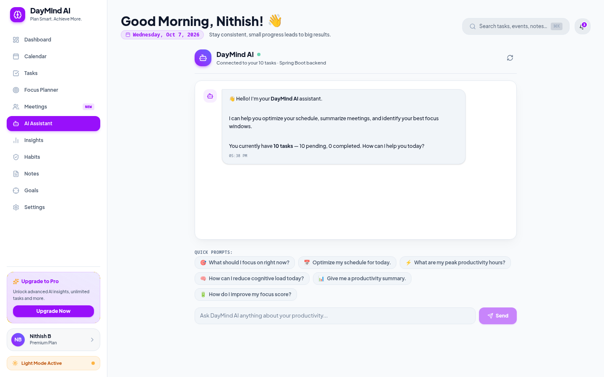
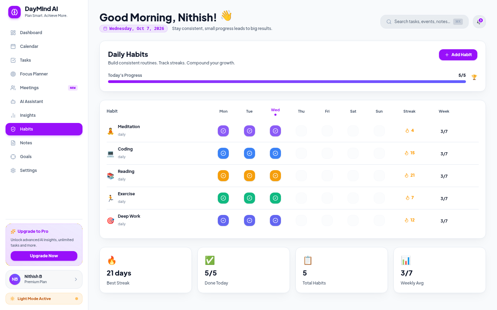
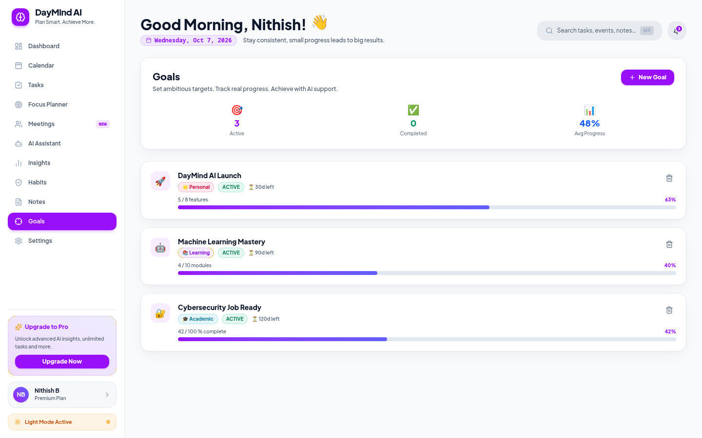

# 🚀 DAYMIND AI — Autonomous AI-Powered Schedule & Productivity Platform

[](https://www.oracle.com/java/)
[](https://spring.io/projects/spring-boot)
[](https://react.dev/)
[](https://tailwindcss.com/)
[](LICENSE)

**DAYMIND AI** is an intelligent, autonomous daily productivity and schedule optimization platform. Built with a high-contrast light theme UI, it bridges **Core Java Object-Oriented Programming (OOP) principles**, **Spring Boot microservices**, and **Google Gemini Generative AI** to solve real-world student and professional time-management challenges.

---

## 🌟 Key Features

* 🤖 **Gemini AI Copilot & Schedule Optimizer**: Natural language scheduling, natural task parsing, and automatic self-healing schedule optimization.
* 📊 **AI Task Kanban Board**: Categorized task tracking utilizing Java OOP inheritance (`AcademicTask`, `WorkTask`, `HealthTask`, `PersonalTask`, `LearningTask`, `UrgentTask`).
* 🎙️ **Meeting Intelligence Engine**: Converts raw meeting transcripts into summaries, key decisions, and automatically schedules action items into open calendar time slots.
* 📚 **Multi-Day Learning Roadmap Wizard**: Auto-generates structured day-by-day learning curricula and schedules daily focus blocks.
* 🎧 **Synthesized Web Audio Ambient Engine**: Zero-dependency Web Audio API procedural sound engine generating 🌧 *Rain*, 🌊 *Ocean Waves* (LFO modulated), 〰️ *White Noise*, and ☕ *Café Ambiance*.
* 🎯 **Habits & Goals Milestone Engine**: Habit matrix with streak tracking (`Habit.java`) and target metric tracking (`Goal.java`).

---

## 🛠️ Technology Stack

| Component | Technology | Description |
| :--- | :--- | :--- |
| **Backend Core** | Java 17 / 21 | Strongly-typed OOP architecture |
| **Backend Framework** | Spring Boot 3.x | REST API controllers, Spring Data JPA, Hibernate |
| **Database Engine** | H2 Database | Persistent file DB (`jdbc:h2:file:./data/dayminddb`) with Web H2 Console |
| **AI Integration** | Google Gemini 1.5 Flash API | AI copilot, transcript processing, roadmap generation |
| **Frontend Framework** | React 18 + Vite | Component-driven UI with Vite build bundling |
| **Styling & UI** | Tailwind CSS + Modern CSS | Pure high-contrast light theme UI & glassmorphic cards |
| **Audio Engine** | Web Audio API | Procedural sound synthesizer for ambient focus audio |

---

## ⚡ Quick Start & Run Commands

### Prerequisites
* **Java JDK 17+** installed (`java -version`)
* **Node.js 18+** & **npm** installed (`node -v`)

---

### 1️⃣ Run Backend (Spring Boot Server)

Open **Terminal 1**:

```bash
cd backend
./mvnw spring-boot:run
```

*(On Windows PowerShell / CMD: `.\mvnw.cmd spring-boot:run`)*

* **Backend Base API**: `http://localhost:8080`
* **H2 Database Console**: `http://localhost:8080/h2-console`
  - **JDBC URL**: `jdbc:h2:file:./data/dayminddb`
  - **Username**: `sa`
  - **Password**: *(leave empty)*

---

### 2️⃣ Run Frontend (React + Vite Web App)

Open **Terminal 2**:

```bash
cd frontend
npm install
npm run dev
```

* **Frontend Web Application**: `http://localhost:5173`

---

### 🚀 Single-Line Launch Command (Linux / macOS)

To launch both backend and frontend concurrently:

```bash
(cd backend && ./mvnw spring-boot:run) & (cd frontend && npm run dev)
```

---

## ☕ Core Java OOP Concepts Applied (PBL Criteria)

1. **Abstraction (`BaseTask.java`)**: Abstract base class requiring subclasses to implement `getCategoryMultiplier()`, `getPriorityWeight()`, and `calculateFlexibilityScore()`.
2. **Encapsulation**: Private state fields protected by getters/setters and state mutation rules (`updatePredictedDurationAndFlexibility()`).
3. **Inheritance & Subclasses**:
   - `AcademicTask` (Multiplier = `1.25` → +25% duration correction)
   - `WorkTask` (Multiplier = `1.15` → +15% duration correction)
   - `HealthTask` (Multiplier = `1.30` → +30% duration correction)
   - `PersonalTask` (Multiplier = `0.95` → -5% adjustment)
   - `LearningTask` (Multiplier = `1.20` → +20% skill buffer)
   - `UrgentTask` (Priority Weight = `1.00` → Preemption slot)
4. **Polymorphism**: Dynamic method dispatch for category multiplier and flexibility calculation.
5. **Design Patterns**:
   - **Factory Pattern (`TaskFactory.java`)**: Instantiates task subclasses based on category enums.
   - **Strategy Pattern (`FlexibilityBumpingStrategy.java`)**: Bumps tasks using the flexibility formula $\frac{1.0 - \text{PriorityWeight}}{\max(\text{CompletionProbability}, 0.01)}$.

---

## 🖼️ Application Screenshots

| Main Dashboard | Weekly Calendar |
| :---: | :---: |
|  |  |

| Tasks Kanban Board | Deep Focus Planner |
| :---: | :---: |
|  |  |

| Meeting Intelligence Engine | AI Assistant Copilot |
| :---: | :---: |
|  |  |

| Daily Habit Matrix | Goals & Target Tracker |
| :---: | :---: |
|  |  |

---

## 📚 Technical Documentation & Presentation Guides

Detailed technical specifications and presentation slides guides are available in the repository:

* 📄 [**5-Page Code & Database Architecture Document**](docs/daymind_architecture_code_document.md)
* 🎓 [**Complete Presentation & Technical Guide**](docs/daymind_project_presentation_guide.md)
* 📸 [**Full Screenshots Directory**](docs/screenshots/)

---

## 📝 License

This project is open-source and available under the [MIT License](LICENSE).
