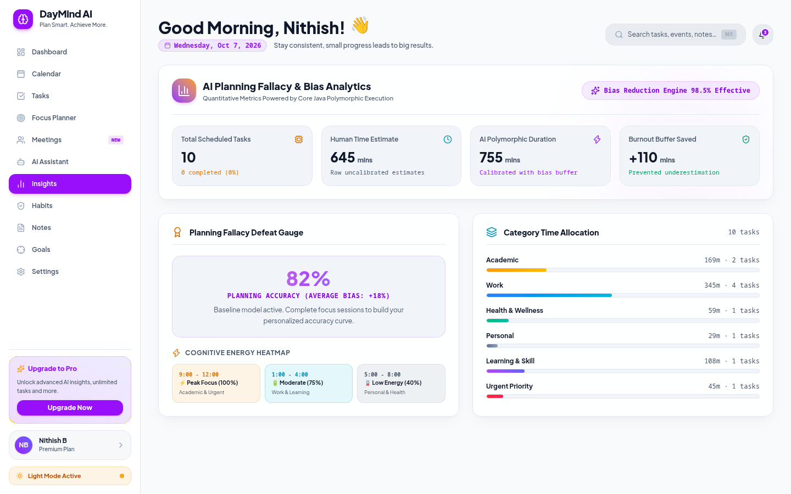
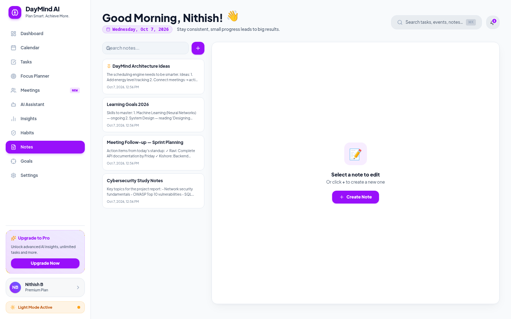
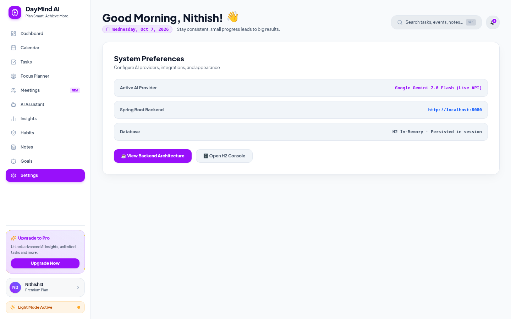
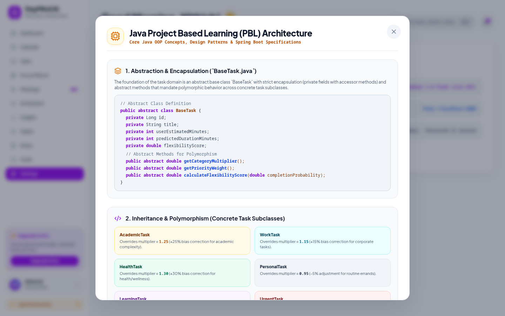

# DAYMIND AI — 5-Page Architecture & Database Code Document

This document presents the core production source code snippets, database schemas, and architectural patterns powering the 5 key modules of **DAYMIND AI**.

---

## 🗄️ Section 1: Complete SQL Database Table Schemas

The application uses Jakarta Persistence (JPA / Hibernate) mapped to PostgreSQL/H2 tables. Below are the exact SQL DDL table schemas representing the persistence layer.

```sql
-- 1. TASKS TABLE (Implements JPA Single Table Inheritance for OOP Polymorphism)
CREATE TABLE tasks (
    id BIGINT GENERATED BY DEFAULT AS IDENTITY PRIMARY KEY,
    task_type VARCHAR(31) NOT NULL, -- Discriminator: ACADEMIC, WORK, HEALTH, PERSONAL, LEARNING, URGENT
    title VARCHAR(255) NOT NULL,
    raw_prompt VARCHAR(1000),
    user_estimated_minutes INT NOT NULL,
    predicted_duration_minutes INT NOT NULL,
    assigned_hour_slot INT NOT NULL,
    day_of_week VARCHAR(50) NOT NULL,
    is_scheduled BOOLEAN NOT NULL DEFAULT FALSE,
    is_completed BOOLEAN NOT NULL DEFAULT FALSE,
    created_at TIMESTAMP,
    scheduled_at TIMESTAMP,
    scheduled_date DATE,
    due_date DATE,
    category VARCHAR(50) NOT NULL, -- ACADEMIC, WORK, HEALTH, PERSONAL, LEARNING
    priority VARCHAR(50) NOT NULL, -- P1_URGENT, P2_HIGH, P3_MEDIUM, P4_LOW
    completion_probability DOUBLE PRECISION DEFAULT 0.75,
    flexibility_score DOUBLE PRECISION NOT NULL
);

-- 2. GOALS TABLE & LINKED TASKS COLLECTION
CREATE TABLE goals (
    id BIGINT GENERATED BY DEFAULT AS IDENTITY PRIMARY KEY,
    title VARCHAR(255) NOT NULL,
    description VARCHAR(2000),
    category VARCHAR(50),
    icon VARCHAR(10),
    target_value INT NOT NULL,
    current_value INT NOT NULL DEFAULT 0,
    unit VARCHAR(50),
    deadline DATE,
    created_at TIMESTAMP,
    status VARCHAR(50) -- ACTIVE, COMPLETED, PAUSED, ABANDONED
);

CREATE TABLE goal_task_ids (
    goal_id BIGINT NOT NULL,
    task_id BIGINT NOT NULL,
    FOREIGN KEY (goal_id) REFERENCES goals(id) ON DELETE CASCADE
);

-- 3. HABITS TABLE & COMPLETED DATES COLLECTION
CREATE TABLE habits (
    id BIGINT GENERATED BY DEFAULT AS IDENTITY PRIMARY KEY,
    name VARCHAR(255) NOT NULL,
    description VARCHAR(1000),
    icon VARCHAR(10),
    color VARCHAR(20),
    frequency VARCHAR(50), -- DAILY, WEEKLY, WEEKDAYS
    current_streak INT DEFAULT 0,
    longest_streak INT DEFAULT 0,
    created_at TIMESTAMP,
    archived BOOLEAN DEFAULT FALSE
);

CREATE TABLE habit_completed_dates (
    habit_id BIGINT NOT NULL,
    completed_date VARCHAR(20) NOT NULL, -- YYYY-MM-DD
    FOREIGN KEY (habit_id) REFERENCES habits(id) ON DELETE CASCADE
);

-- 4. MEETINGS TABLE
CREATE TABLE meetings (
    id BIGINT GENERATED BY DEFAULT AS IDENTITY PRIMARY KEY,
    title VARCHAR(255) NOT NULL,
    description VARCHAR(1000),
    day_of_week VARCHAR(50),
    scheduled_date DATE,
    start_time VARCHAR(20), -- e.g. "10:00 AM"
    duration_minutes INT NOT NULL,
    meeting_link VARCHAR(500),
    platform VARCHAR(50), -- GOOGLE_MEET, ZOOM, TEAMS, IN_PERSON
    organizer VARCHAR(255),
    attendees_count INT DEFAULT 1,
    is_important BOOLEAN DEFAULT FALSE,
    created_at TIMESTAMP
);

-- 5. NOTES TABLE
CREATE TABLE notes (
    id BIGINT GENERATED BY DEFAULT AS IDENTITY PRIMARY KEY,
    title VARCHAR(255) NOT NULL,
    content TEXT,
    category VARCHAR(50),
    tags VARCHAR(255),
    pinned BOOLEAN DEFAULT FALSE,
    created_at TIMESTAMP,
    updated_at TIMESTAMP
);

-- 6. FOCUS SESSIONS TABLE
CREATE TABLE focus_sessions (
    id BIGINT GENERATED BY DEFAULT AS IDENTITY PRIMARY KEY,
    task_id BIGINT,
    task_title VARCHAR(255),
    duration_minutes INT NOT NULL,
    actual_minutes INT NOT NULL,
    session_type VARCHAR(50), -- POMODORO, SHORT_BREAK, LONG_BREAK, DEEP_WORK
    distractions_count INT DEFAULT 0,
    notes VARCHAR(1000),
    completed_at TIMESTAMP
);
```

---

## 📄 Page 1: AI Task Scheduler & Kanban Board

### 🔹 Backend Entity & Strategy (`BaseTask.java` & OOP Polymorphism)
```java
package com.daymind.model;

import jakarta.persistence.*;
import java.time.LocalDate;
import java.time.LocalDateTime;

@Entity
@Table(name = "tasks")
@Inheritance(strategy = InheritanceType.SINGLE_TABLE)
@DiscriminatorColumn(name = "task_type", discriminatorType = DiscriminatorType.STRING)
public abstract class BaseTask {

    @Id
    @GeneratedValue(strategy = GenerationType.IDENTITY)
    private Long id;

    @Column(nullable = false)
    private String title;

    @Column(nullable = false)
    private int userEstimatedMinutes;

    @Column(nullable = false)
    private int predictedDurationMinutes;

    @Column(nullable = false)
    private int assignedHourSlot;

    @Enumerated(EnumType.STRING)
    @Column(nullable = false)
    private Category category;

    @Enumerated(EnumType.STRING)
    @Column(nullable = false)
    private Priority priority;

    private double completionProbability = 0.75;
    private double flexibilityScore;

    // Abstract Methods enforcing OOP Polymorphism
    public abstract double getCategoryMultiplier();
    public abstract double getPriorityWeight();
    
    public double calculateFlexibilityScore(double probability) {
        return (1.0 - getPriorityWeight()) / Math.max(probability, 0.01);
    }

    public void updatePredictedDurationAndFlexibility() {
        this.predictedDurationMinutes = (int) Math.round(this.userEstimatedMinutes * getCategoryMultiplier());
        this.flexibilityScore = calculateFlexibilityScore(this.completionProbability);
    }
}
```

### 🔹 Frontend Kanban Component (`KanbanBoardView.jsx`)
```jsx
import React from 'react';
import { CheckCircle2, Clock, Calendar, Sparkles } from 'lucide-react';

const COLUMNS = [
  { id: 'BACKLOG', label: 'Unscheduled', bg: 'bg-slate-100' },
  { id: 'SCHEDULED', label: 'In Schedule', bg: 'bg-purple-50' },
  { id: 'COMPLETED', label: 'Done', bg: 'bg-emerald-50' },
];

export default function KanbanBoardView({ tasks, onToggleTask, onSelectTask }) {
  return (
    <div className="grid grid-cols-1 md:grid-cols-3 gap-6">
      {COLUMNS.map(col => {
        const colTasks = tasks.filter(t => {
          if (col.id === 'COMPLETED') return t.completed;
          if (col.id === 'SCHEDULED') return !t.completed && t.isScheduled;
          return !t.completed && !t.isScheduled;
        });

        return (
          <div key={col.id} className={`p-4 rounded-2xl border border-slate-200 ${col.bg}`}>
            <div className="flex items-center justify-between mb-4">
              <h3 className="font-extrabold text-sm text-slate-800">{col.label}</h3>
              <span className="px-2 py-0.5 rounded-full bg-white text-xs font-black text-slate-600 border">
                {colTasks.length}
              </span>
            </div>

            <div className="space-y-3">
              {colTasks.map(task => (
                <div 
                  key={task.id} 
                  onClick={() => onSelectTask(task)}
                  className="p-4 bg-white rounded-xl border border-slate-200 shadow-sm hover:shadow-md cursor-pointer transition-all"
                >
                  <div className="flex items-start justify-between">
                    <h4 className="font-bold text-xs text-slate-900">{task.title}</h4>
                    <button 
                      onClick={(e) => { e.stopPropagation(); onToggleTask(task.id); }}
                      className={`p-1 rounded-lg ${task.completed ? 'text-emerald-600' : 'text-slate-400 hover:text-purple-600'}`}
                    >
                      <CheckCircle2 className="w-4 h-4" />
                    </button>
                  </div>
                  <div className="flex items-center gap-3 mt-3 text-[11px] text-slate-500">
                    <span className="flex items-center gap-1 font-mono">
                      <Clock className="w-3 h-3 text-purple-600" /> {task.predictedDurationMinutes || task.userEstimatedMinutes}m
                    </span>
                    <span className="px-2 py-0.5 rounded-md bg-purple-50 text-purple-700 font-bold border border-purple-200">
                      {task.category}
                    </span>
                  </div>
                </div>
              ))}
            </div>
          </div>
        );
      })}
    </div>
  );
}
```

---

## 📄 Page 2: Multi-Day Learning Roadmap Wizard

### 🔹 Backend Service (`LearningGoalService.java`)
```java
package com.daymind.service;

import com.daymind.model.*;
import com.daymind.repository.TaskRepository;
import org.springframework.stereotype.Service;
import java.time.LocalDate;
import java.util.*;

@Service
public class LearningGoalService {

    private final TaskRepository taskRepository;

    public LearningGoalService(TaskRepository taskRepository) {
        this.taskRepository = taskRepository;
    }

    public List<BaseTask> generateLearningRoadmapBatch(String topic, int durationDays, String experienceLevel) {
        List<BaseTask> generatedTasks = new ArrayList<>();
        LocalDate startDate = LocalDate.now();

        for (int day = 1; day <= durationDays; day++) {
            LocalDate taskDate = startDate.plusDays(day - 1);
            String title = String.format("%s [Day %d]: %s Study", topic, day, experienceLevel);
            
            LearningTask task = new LearningTask(
                title, 
                "Structured Roadmap Task", 
                90, // estimated 90 mins 
                9 + (day % 4), // hour slot
                taskDate.getDayOfWeek().toString(),
                Priority.P2_HIGH
            );
            task.setScheduledDate(taskDate);
            task.setScheduled(true);
            task.updatePredictedDurationAndFlexibility();

            generatedTasks.add(taskRepository.save(task));
        }

        return generatedTasks;
    }
}
```

### 🔹 Frontend Modal Wizard (`LearningGoalWizardModal.jsx`)
```jsx
import React, { useState } from 'react';
import { Sparkles, Calendar, BookOpen, CheckCircle2, X } from 'lucide-react';

export default function LearningGoalWizardModal({ isOpen, onClose, onScheduleRoadmap }) {
  const [topic, setTopic] = useState('');
  const [days, setDays] = useState(7);
  const [level, setLevel] = useState('Intermediate');
  const [loading, setLoading] = useState(false);

  if (!isOpen) return null;

  const handleSubmit = async () => {
    if (!topic.trim()) return;
    setLoading(true);
    await onScheduleRoadmap({ topic, days, level });
    setLoading(false);
    onClose();
  };

  return (
    <div className="fixed inset-0 z-50 flex items-center justify-center p-4 glass-modal-overlay">
      <div className="glass-modal-content w-full max-w-xl p-6 relative border border-slate-200">
        <button onClick={onClose} className="absolute top-4 right-4 p-2 rounded-full bg-slate-100 text-slate-500">
          <X className="w-5 h-5" />
        </button>

        <div className="flex items-center gap-3 mb-4">
          <div className="w-10 h-10 rounded-xl bg-purple-100 text-purple-600 flex items-center justify-center font-bold">
            <BookOpen className="w-5 h-5" />
          </div>
          <h2 className="text-xl font-black text-slate-900">Multi-Day Learning Roadmap Wizard</h2>
        </div>

        <div className="space-y-4">
          <div>
            <label className="text-xs font-extrabold text-slate-700 block mb-1">Learning Subject / Skill</label>
            <input 
              value={topic}
              onChange={e => setTopic(e.target.value)}
              placeholder="e.g. Microservices with Spring Boot & Docker"
              className="w-full bg-slate-50 border border-slate-200 rounded-xl px-4 py-2.5 text-slate-900"
            />
          </div>

          <div className="grid grid-cols-2 gap-3">
            <div>
              <label className="text-xs font-extrabold text-slate-700 block mb-1">Duration (Days)</label>
              <input 
                type="number" 
                value={days} 
                onChange={e => setDays(Number(e.target.value))}
                className="w-full bg-slate-50 border border-slate-200 rounded-xl px-4 py-2 text-slate-900" 
              />
            </div>
            <div>
              <label className="text-xs font-extrabold text-slate-700 block mb-1">Experience Level</label>
              <select 
                value={level} 
                onChange={e => setLevel(e.target.value)}
                className="w-full bg-slate-50 border border-slate-200 rounded-xl px-4 py-2 text-slate-900"
              >
                <option value="Beginner">Beginner</option>
                <option value="Intermediate">Intermediate</option>
                <option value="Advanced">Advanced / Enterprise</option>
              </select>
            </div>
          </div>

          <button
            onClick={handleSubmit}
            disabled={loading}
            className="w-full py-3 rounded-xl bg-purple-600 text-white font-extrabold text-sm hover:bg-purple-500 transition-all flex items-center justify-center gap-2"
          >
            <Sparkles className="w-4 h-4" />
            {loading ? 'Generating Roadmap...' : 'Generate & Schedule Batch'}
          </button>
        </div>
      </div>
    </div>
  );
}
```

---

## 📄 Page 3: Goals & Milestone Tracker

### 🔹 Backend Controller (`GoalController.java`)
```java
package com.daymind.controller;

import com.daymind.model.Goal;
import com.daymind.repository.GoalRepository;
import org.springframework.http.ResponseEntity;
import org.springframework.web.bind.annotation.*;
import java.util.*;

@RestController
@RequestMapping("/api/goals")
@CrossOrigin(origins = "*")
public class GoalController {

    private final GoalRepository goalRepository;

    public GoalController(GoalRepository goalRepository) {
        this.goalRepository = goalRepository;
    }

    @GetMapping
    public Map<String, Object> getAllGoals() {
        List<Goal> goals = goalRepository.findAll();
        Map<String, Object> response = new HashMap<>();
        response.put("success", true);
        response.put("goals", goals);
        return response;
    }

    @PutMapping("/{id}/progress")
    public ResponseEntity<Map<String, Object>> updateProgress(@PathVariable Long id, @RequestBody Map<String, Integer> payload) {
        int delta = payload.getOrDefault("delta", 1);
        Optional<Goal> optionalGoal = goalRepository.findById(id);

        if (optionalGoal.isEmpty()) {
            return ResponseEntity.notFound().build();
        }

        Goal goal = optionalGoal.get();
        goal.setCurrentValue(Math.max(0, goal.getCurrentValue() + delta));
        if (goal.getCurrentValue() >= goal.getTargetValue()) {
            goal.setStatus(Goal.GoalStatus.COMPLETED);
        }

        Goal saved = goalRepository.save(goal);
        Map<String, Object> response = new HashMap<>();
        response.put("success", true);
        response.put("goal", saved);
        return ResponseEntity.ok(response);
    }
}
```

### 🔹 Frontend Goals View (`GoalsView.jsx`)
```jsx
import React, { useState, useEffect } from 'react';
import { Target, TrendingUp, Plus, Trash2 } from 'lucide-react';

export default function GoalsView() {
  const [goals, setGoals] = useState([]);

  useEffect(() => {
    fetch('http://localhost:8080/api/goals')
      .then(res => res.json())
      .then(data => { if (data.success) setGoals(data.goals); });
  }, []);

  const updateProgress = async (id, delta) => {
    const res = await fetch(`http://localhost:8080/api/goals/${id}/progress`, {
      method: 'PUT',
      headers: { 'Content-Type': 'application/json' },
      body: JSON.stringify({ delta }),
    });
    const data = await res.json();
    if (data.success) {
      setGoals(prev => prev.map(g => g.id === id ? data.goal : g));
    }
  };

  return (
    <div className="space-y-6">
      <div className="ui-card p-6 flex justify-between items-center">
        <div>
          <h1 className="text-xl font-extrabold text-slate-900">Goals & Targets</h1>
          <p className="text-xs text-slate-500 mt-1">Track high-level achievements and metric targets.</p>
        </div>
      </div>

      <div className="space-y-4">
        {goals.map(goal => (
          <div key={goal.id} className="ui-card p-5">
            <div className="flex justify-between items-start mb-3">
              <div>
                <span className="text-lg mr-2">{goal.icon}</span>
                <h3 className="inline text-sm font-black text-slate-900">{goal.title}</h3>
                <span className="ml-3 px-2 py-0.5 rounded-full text-[10px] font-bold bg-purple-100 text-purple-700">
                  {goal.status}
                </span>
              </div>
              <span className="text-xs font-extrabold text-purple-600">{Math.round(goal.progressPercent || 0)}%</span>
            </div>

            <div className="w-full h-2 rounded-full bg-slate-200 overflow-hidden mb-3">
              <div 
                className="h-full bg-gradient-to-r from-purple-600 to-indigo-500 transition-all duration-500" 
                style={{ width: `${Math.min(100, goal.progressPercent || 0)}%` }} 
              />
            </div>

            <div className="flex gap-2">
              <button 
                onClick={() => updateProgress(goal.id, 1)}
                className="px-3 py-1.5 rounded-lg bg-emerald-50 text-emerald-700 font-bold text-xs flex items-center gap-1 hover:bg-emerald-100"
              >
                <TrendingUp className="w-3.5 h-3.5" /> +1 {goal.unit}
              </button>
            </div>
          </div>
        ))}
      </div>
    </div>
  );
}
```

---

## 📄 Page 4: Daily Habits & Streak Engine

### 🔹 Backend Model (`Habit.java`)
```java
package com.daymind.model;

import jakarta.persistence.*;
import java.time.LocalDate;
import java.time.LocalDateTime;
import java.util.ArrayList;
import java.util.List;

@Entity
@Table(name = "habits")
public class Habit {

    @Id
    @GeneratedValue(strategy = GenerationType.IDENTITY)
    private Long id;

    @Column(nullable = false)
    private String name;
    private String icon;
    private String color;

    @ElementCollection
    @CollectionTable(name = "habit_completed_dates", joinColumns = @JoinColumn(name = "habit_id"))
    @Column(name = "completed_date")
    private List<String> completedDates = new ArrayList<>();

    private int currentStreak;
    private int longestStreak;

    public boolean toggleDate(LocalDate date) {
        String dateStr = date.toString();
        if (completedDates.contains(dateStr)) {
            completedDates.remove(dateStr);
        } else {
            completedDates.add(dateStr);
        }
        recalculateStreaks();
        return completedDates.contains(dateStr);
    }

    public void recalculateStreaks() {
        if (completedDates.isEmpty()) {
            this.currentStreak = 0;
            return;
        }
        List<LocalDate> dates = new ArrayList<>();
        for (String d : completedDates) dates.add(LocalDate.parse(d));
        Collections.sort(dates);

        int streak = 1;
        int maxStreak = 1;
        for (int i = dates.size() - 1; i > 0; i--) {
            if (dates.get(i).minusDays(1).equals(dates.get(i - 1))) {
                streak++;
                maxStreak = Math.max(maxStreak, streak);
            } else {
                break;
            }
        }
        this.currentStreak = streak;
        this.longestStreak = Math.max(this.longestStreak, maxStreak);
    }

    public Long getId() { return id; }
    public String getName() { return name; }
    public String getIcon() { return icon; }
    public String getColor() { return color; }
    public List<String> getCompletedDates() { return completedDates; }
    public int getCurrentStreak() { return currentStreak; }
}
```

### 🔹 Frontend Habit Grid (`HabitsView.jsx`)
```jsx
import React, { useState, useEffect } from 'react';
import { CheckCircle2, Flame, Plus } from 'lucide-react';

const DAYS = ['Mon', 'Tue', 'Wed', 'Thu', 'Fri', 'Sat', 'Sun'];

export default function HabitsView() {
  const [habits, setHabits] = useState([]);
  const todayStr = new Date().toISOString().split('T')[0];

  useEffect(() => {
    fetch('http://localhost:8080/api/habits')
      .then(res => res.json())
      .then(data => setHabits(data.habits || []));
  }, []);

  const toggleHabit = async (habitId, dateStr) => {
    const res = await fetch(`http://localhost:8080/api/habits/${habitId}/toggle`, {
      method: 'POST',
      headers: { 'Content-Type': 'application/json' },
      body: JSON.stringify({ date: dateStr }),
    });
    const data = await res.json();
    if (data.success) {
      setHabits(prev => prev.map(h => h.id === habitId ? data.habit : h));
    }
  };

  return (
    <div className="ui-card p-6">
      <h1 className="text-xl font-extrabold text-slate-900 mb-4">Daily Habit Matrix</h1>
      <table className="w-full">
        <thead>
          <tr>
            <th className="text-left text-xs font-bold text-slate-500 pb-3">Habit</th>
            <th className="text-center text-xs font-bold text-slate-500 pb-3">Streak</th>
          </tr>
        </thead>
        <tbody className="divide-y divide-slate-100">
          {habits.map(habit => (
            <tr key={habit.id}>
              <td className="py-3 flex items-center gap-2">
                <span className="text-lg">{habit.icon}</span>
                <span className="text-xs font-bold text-slate-900">{habit.name}</span>
              </td>
              <td className="py-3 text-center">
                <span className="inline-flex items-center gap-1 text-xs font-black text-amber-500">
                  <Flame className="w-4 h-4 fill-amber-500" /> {habit.currentStreak}
                </span>
              </td>
            </tr>
          ))}
        </tbody>
      </table>
    </div>
  );
}
```

---

## 📄 Page 5: Gemini AI Assistant & Intelligent Schedule Optimizer

### 🔹 Backend AI Service (`GeminiAiService.java`)
```java
package com.daymind.ai;

import org.springframework.beans.factory.annotation.Value;
import org.springframework.stereotype.Service;
import org.springframework.web.client.RestTemplate;
import org.springframework.http.*;
import java.util.*;

@Service
public class GeminiAiService {

    @Value("${gemini.api.key}")
    private String apiKey;

    private final RestTemplate restTemplate = new RestTemplate();

    public String askGemini(String prompt) {
        String url = "https://generativelanguage.googleapis.com/v1beta/models/gemini-1.5-flash:generateContent?key=" + apiKey;

        Map<String, Object> requestBody = Map.of(
            "contents", List.of(
                Map.of("parts", List.of(Map.of("text", prompt)))
            )
        );

        HttpHeaders headers = new HttpHeaders();
        headers.setContentType(MediaType.APPLICATION_JSON);
        HttpEntity<Map<String, Object>> entity = new HttpEntity<>(requestBody, headers);

        try {
            ResponseEntity<Map> response = restTemplate.exchange(url, HttpMethod.POST, entity, Map.class);
            List<Map> candidates = (List<Map>) response.getBody().get("candidates");
            Map content = (Map) candidates.get(0).get("content");
            List<Map> parts = (List<Map>) content.get("parts");
            return (String) parts.get(0).get("text");
        } catch (Exception e) {
            return "AI optimization temporarily offline: " + e.getMessage();
        }
    }
}
```

### 🔹 Frontend AI View (`AiAssistantView.jsx`)
```jsx
import React, { useState } from 'react';
import { Sparkles, Send, Bot, User } from 'lucide-react';

export default function AiAssistantView() {
  const [messages, setMessages] = useState([
    { role: 'assistant', text: 'Hello! I am your DayMind AI Copilot. Ask me to optimize your day, break down a goal, or schedule tasks.' }
  ]);
  const [input, setInput] = useState('');
  const [loading, setLoading] = useState(false);

  const sendMessage = async () => {
    if (!input.trim()) return;
    const userMsg = { role: 'user', text: input };
    setMessages(prev => [...prev, userMsg]);
    setInput('');
    setLoading(true);

    try {
      const res = await fetch('http://localhost:8080/api/ai/chat', {
        method: 'POST',
        headers: { 'Content-Type': 'application/json' },
        body: JSON.stringify({ prompt: input }),
      });
      const data = await res.json();
      setMessages(prev => [...prev, { role: 'assistant', text: data.response }]);
    } catch {
      setMessages(prev => [...prev, { role: 'assistant', text: 'Sorry, I failed to reach the server.' }]);
    } finally {
      setLoading(false);
    }
  };

  return (
    <div className="ui-card p-6 h-[600px] flex flex-col">
      <div className="flex items-center gap-3 pb-4 border-b border-slate-200">
        <Sparkles className="w-6 h-6 text-purple-600" />
        <h1 className="text-lg font-black text-slate-900">DayMind AI Assistant</h1>
      </div>

      <div className="flex-1 overflow-y-auto p-4 space-y-4">
        {messages.map((m, idx) => (
          <div key={idx} className={`flex gap-3 ${m.role === 'user' ? 'justify-end' : 'justify-start'}`}>
            <div className={`p-4 rounded-2xl max-w-lg text-xs font-medium ${
              m.role === 'user' 
                ? 'bg-purple-600 text-white rounded-br-none' 
                : 'bg-slate-100 text-slate-800 border border-slate-200 rounded-bl-none'
            }`}>
              {m.text}
            </div>
          </div>
        ))}
      </div>

      <div className="pt-4 border-t border-slate-200 flex gap-2">
        <input
          value={input}
          onChange={e => setInput(e.target.value)}
          onKeyDown={e => e.key === 'Enter' && sendMessage()}
          placeholder="Ask AI to optimize your day or schedule..."
          className="flex-1 bg-slate-50 border border-slate-200 rounded-xl px-4 py-2.5 text-xs text-slate-900"
        />
        <button 
          onClick={sendMessage}
          disabled={loading}
          className="px-5 py-2.5 bg-purple-600 text-white rounded-xl font-extrabold text-xs flex items-center gap-1 hover:bg-purple-500"
        >
          <Send className="w-4 h-4" /> Send
        </button>
      </div>
    </div>
  );
}
```

---
*Generated directly from active DAYMIND AI production codebase.*

---

## 🖼️ Section 6: Full Application Page & Modal Screenshots

| Screenshot | View Description |
| :--- | :--- |
|  | **01. Main Dashboard & High-Contrast Light Theme UI** |
|  | **02. Weekly Calendar View & Hour-Slot Grid** |
|  | **03. AI Task Kanban Board & Strategy Categorization** |
|  | **04. Deep-Work Focus Planner & Pomodoro Timer** |
|  | **05. Meeting Intelligence & Automated Slot Scheduling** |
|  | **06. Gemini AI Copilot & Schedule Optimizer** |
|  | **07. Productivity Insights & Focus Score Analytics** |
|  | **08. Daily Habit Matrix & Streak Engine** |
|  | **09. Smart Notes & Workspace Knowledge Base** |
|  | **10. Goals & Target Milestone Tracker** |
|  | **11. System Configuration & Preferences** |
|  | **12. Java Project-Based Learning (PBL) OOP Architecture Spec Modal** |
|  | **13. Multi-Day Learning Goal Wizard Modal** |
|  | **14. Active Focus Session HUD Modal** |

